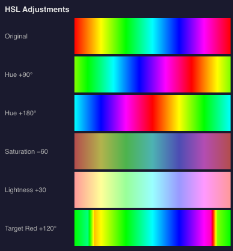
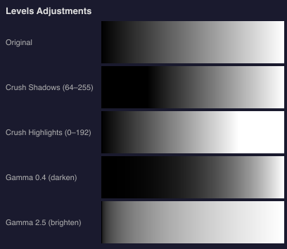
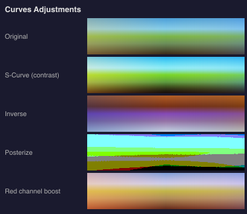

# @genart-dev/plugin-color-adjust

Color adjustment design layer plugin for [genart.dev](https://genart.dev) — non-destructive HSL, Levels, and Curves adjustment layers with per-channel control. Includes MCP tools for AI-agent control.

Part of [genart.dev](https://genart.dev) — a generative art platform with an MCP server, desktop app, and IDE extensions.

## Examples



Hue shifting, desaturation, lightness, and hue-targeted adjustments applied to a rainbow gradient.

<table>
<tr>
<td><br><em>Levels: shadow/highlight crush, gamma</em></td>
<td><br><em>Curves: S-curve, invert, posterize, per-channel</em></td>
</tr>
</table>

## Install

```bash
npm install @genart-dev/plugin-color-adjust
```

## Usage

```typescript
import colorAdjustPlugin from "@genart-dev/plugin-color-adjust";
import { createDefaultRegistry } from "@genart-dev/core";

const registry = createDefaultRegistry();
registry.registerPlugin(colorAdjustPlugin);

// Or access individual exports
import {
  hslLayerType,
  levelsLayerType,
  curvesLayerType,
  colorAdjustMcpTools,
  buildLevelsLut,
  buildCurvesLut,
  computeHistogram,
} from "@genart-dev/plugin-color-adjust";
```

## Layer Types

### HSL Adjustment (`adjust:hsl`)

Pixel-level hue, saturation, and lightness adjustment with optional hue-range targeting and smooth falloff.

| Property | Type | Default | Description |
|----------|------|---------|-------------|
| `hue` | number | `0` | Hue shift (−180–180) |
| `saturation` | number | `0` | Saturation shift (−100–100) |
| `lightness` | number | `0` | Lightness shift (−100–100) |
| `targetHue` | number | `-1` | Target hue angle (−1 = all colors) |
| `targetRange` | number | `30` | Target range in degrees (0–180) |
| `targetFalloff` | number | `15` | Falloff width in degrees (0–90) |

### Levels (`adjust:levels`)

Input/output range remapping with gamma correction, per-channel or RGB.

| Property | Type | Default | Description |
|----------|------|---------|-------------|
| `inputBlack` | number | `0` | Input black point (0–255) |
| `inputWhite` | number | `255` | Input white point (0–255) |
| `gamma` | number | `1.0` | Gamma (0.1–10) |
| `outputBlack` | number | `0` | Output black point (0–255) |
| `outputWhite` | number | `255` | Output white point (0–255) |
| `channel` | select | `"rgb"` | Channel: `rgb`, `r`, `g`, `b` |

### Curves (`adjust:curves`)

Arbitrary tone curve via control points, using monotone cubic (Fritsch-Carlson) or linear interpolation.

| Property | Type | Default | Description |
|----------|------|---------|-------------|
| `points` | string (JSON) | `"[[0,0],[255,255]]"` | Control points as `[input, output][]` |
| `channel` | select | `"rgb"` | Channel: `rgb`, `r`, `g`, `b` |
| `interpolation` | select | `"monotone-cubic"` | `monotone-cubic` or `linear` |

## MCP Tools (4)

| Tool | Description |
|------|-------------|
| `adjust_hsl` | Create or update an HSL adjustment layer |
| `adjust_levels` | Create or update a levels adjustment layer |
| `adjust_curves` | Create or update a curves adjustment layer |
| `auto_levels` | Auto-normalize tonal range via histogram analysis |

## API Reference

### `buildLevelsLut(inputBlack, inputWhite, gamma, outputBlack, outputWhite)`

Returns a `Uint8Array` (256 entries) lookup table for levels adjustment.

### `buildCurvesLut(points)`

Returns a `Uint8Array` LUT from monotone cubic interpolation of control points.

### `computeHistogram(data, totalPixels)`

Computes per-channel and luminosity histograms with auto-detected black/white points.

## Related Packages

| Package | Purpose |
|---------|---------|
| [`@genart-dev/core`](https://github.com/genart-dev/core) | Plugin host, layer system (dependency) |
| [`@genart-dev/mcp-server`](https://github.com/genart-dev/mcp-server) | MCP server that surfaces plugin tools to AI agents |

## Support

Questions, bugs, or feedback — [support@genart.dev](mailto:support@genart.dev) or [open an issue](https://github.com/genart-dev/plugin-color-adjust/issues).

## License

MIT
